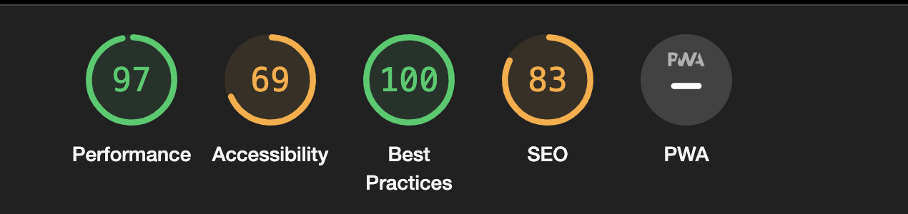

# Birmingham egg

The Bully Book Club website is designed to be responsive website allowing visitors to view on a range of devices. It allows visitors to find out about the book club.

[View Birmingham Egg on Github Pages](https://itzrossyo.github.io/Birmingham-egg-milestone-project/)

## CONTENTS

-   [User Experience (UX)](<#User-Experience-(UX)>)

    -   [Initial Discussion](#Initial-Discussion)
    -   [User Stories](#User-Stories)

-   [Design](#Design)

    -   [Colour Scheme](#Colour-Scheme)
    -   [Typography](#Typography)
    -   [Imagery](#Imagery)
    -   [Wireframes](#Wireframes)
    -   [Features](#Features)
    -   [Accessibility](#Accessibility)

-   [Technologies Used](#Technologies-Used)

    -   [Languages Used](#Languages-Used)
    -   [Frameworks, Libraries & Programs Used](#Frameworks,-Libraries-&-Programs-Used)

-   [Deployment & Local Development](#Deployment-&-Local-Development)

    -   [Deployment](#Deployment)
    -   [Local Development](#Local-Development)
        -   [How to Fork](#How-to-Fork)
        -   [How to Clone](#How-to-Clone)

-   [Testing](#Testing)
    -   [W3C Validator](#W3C-Validator)
    -   [Solved Bugs](#Solved-Bugs)
    -   [Known Bugs](#Known-Bugs)
    -   [Testing User Stories](#Testing-User-Stories)
    -   [Lighthouse](#Lighthouse)
        -   [Index Page](#Index-Page)
        -   [Books Page](#Books-Page)
        -   [Contact Us Page](#Contact-Us-Page)
        -   [Thank You Page](#Thank-You-Page)
    -   [Full Testing](#Full-Testing)
-   [Credits](#Credits)
    -   [Code Used](#Code-Used)
    -   [Content](#Content)
    -   [Media](#Media)
    -   [Acknowledgments](#Acknowledgments)

---

## User Experience (UX)

### Initial Discussion

Birmingham egg is a real life website for thats been re diseinged for modren internet showing all the information about the team members and products that thay have for sale.

#### Key information for the site

-   how to get there.
-   contact information about delvirys.
-   what products they have for sale.

### User Stories

#### Client Goals

-   To be able to view the site on a range of device sizes.
-   To make it easy for potential members of the public to find out what products they have for sale.
-   how to find where they are bassed
-   To allow people to be able to contact Birmginham egg to ask further questions.

#### First Time Visitor Goals

-   I want to find out what birmingham egg sale and how I can vist.
-   I want to be able to navigate the site easily to find information.
-   I want to be able to find their team members profile.

#### Returning Visitor Goals

-   I want to find up to date information on what products i can buy .
-   I want to be able to easily contact birmingham egg with questions I might have.

#### Frequent Visitor Goals

-   I want to be able to recommend brimingham egg.

---

## Design

### Colour Scheme

The website uses a palette of pastel colours that are often used in the Birmingham Eggs images. The colour palette was created using the [Coolors](https://coolors.co/) website.

### Typography

Google Fonts was used for the following fonts:

-   Roboto is used through outsite. with a full back ans-serif.

### Imagery

The member images were used with the permission of their owners from Birmingham Egg.

### Wireframes

Wireframes were created for mobile, tablet and desktop.

[Home Page Wireframe](Assets/readme-images/Homepage-desktop.png)

[Products page Wireframe](/Assets/readme-images/Products-desktop.png)

[About Us Wireframe](/Assets/readme-images/About%20Us-desktop.png)

### Features

The website is comprised of 9 pages, all are accessible from the navigation menu (home page, products page, about us page & contact us page). The 5 other page is a is shown once a user is on the product page and then they are able to select other products to filter out.

-   All Pages on the website have:

    -   A responsive navigation bar at the top which allows the user to navigate through the site. To the left of the navigation bar is an slogan of birmingham eggs moto. in the center of the navigation bar are the links to the websites pages (home, products, about us and contact). To allow a good user experience of the site, the links are hidden with a media query on mobile devices to prevent the navigation bar looking cluttered. When viewing with mobile devices the navigation links change to a burger toggler. This was implemented to give the site a clean look and to promote a good user experience, as users are used to seeing the burger icon when on mobile devices to navigate a site.

    -   A footer which contains the copyright information for the company

-   Home Page.

    -   what are brimgingham egg main features .

-   Contact Us Page.

    -   Form
        The form contains fields for the users name, email address and checkboxes giving a reason for contact and a text area for the user to add further information. The user submits the form using the submit button. Users must fill in the name, email and text area fields to be able to submit the form. If they don't a tooltip will guide them to fill in any information they have missed.

### Accessibility

I have been mindful during coding to ensure that the website is as accessible friendly as possible. I have achieved this by:

-   Using semantic HTML.
-   Using descriptive alt attributes on images on the site.
-   Providing information for screen readers where there are icons used and no text - such as the review ratings for books & footer icons.
-   Ensuring that there is a sufficient colour contrast throughout the site.
-   Ensuring menus are accessible by marking the current page as current for screen readers.

---

## Technologies Used

### Languages Used

HTML and CSS and some javascript were used to create this website.

### Frameworks, Libraries & Programs Used

Git - For version control.

Github - To save and store the files for the website.

Google Fonts - To import the fonts used on the website.

Font Awesome - For the iconography on the website.

Google Dev Tools - To troubleshoot and test features, solve issues with responsiveness and styling.

[Favicon.io](https://favicon.io/) To create favicon.

[Shields.io](https://shields.io/) To add badges to the README

---

## Deployment & Local Development

### Deployment

Github Pages was used to deploy the live website. The instructions to achieve this are below:

1. Log in (or sign up) to Github.
2. Find the repository for this project, Bully-Book-Club.
3. Click on the Settings link.
4. Click on the Pages link in the left hand side navigation bar.
5. In the Source section, choose main from the drop down select branch menu. Select Root from the drop down select folder menu.
6. Click Save. Your live Github Pages site is now deployed at the URL shown.

### Local Development

#### How to Fork

To fork the Birmingham Egg repository:

1. Log in (or sign up) to Github.
2. Go to the repository for this project, Birmingham-egg-milestone-project.
3. Click the Fork button in the top right corner.

#### How to Clone

To clone the Birmingham egg repository:

1. Log in (or sign up) to GitHub.
2. Go to the repository for this project, Birmingham-egg-milestone-project.
3. Click on the code button, select whether you would like to clone with HTTPS, SSH or GitHub CLI and copy the link shown.
4. Open the terminal in your code editor and change the current working directory to the location you want to use for the cloned directory.
5. Type 'git clone' into the terminal and then paste the link you copied in step 3. Press enter.

---

## Testing

Testing was ongoing throughout the entire build. I utilised Chrome developer tools while building to pinpoint and troubleshoot any issues as I went along.

The following issues were raised during my mid project meeting with my mentor:

-   The Join Us section on the home page was not in alignment with the rest of the page. Padding has now been added to bring it in alignment with the rest of the pages padding.
-   There was an issue on smaller devices where the book columns were not displaying properly. This issue is documented under issue 2 in solved bugs.
-   The introduction paragraph on the books page was not aligned in style with the rest of the page. The text has now been centered.
-   The form could be submitted with only a name filled in. ~ A required attribute has been added to the email input and textarea.

### W3C Validator

The W3C validator was used to validate the HTML on all pages of the website. It was also used to validate CSS in the style.css file.

-   [Index Page HTML](docs/testing/w3c/w3cindex.png)
-   [Books Page HTML](docs/testing/w3c/w3cbooks.png)
-   [Contact Us Page HTML](docs/testing/w3c/w3ccontact.png)
-   [Thank You Page HTML](docs/testing/w3c/w3cthankyou.png)
-   [404 Page HTML](docs/testing/w3c/w3c404.png)
-   [style.css CSS](docs/testing/w3c/w3ccss.png)

### Solved Bugs

### Known Bugs

### Testing User Stories

-   First Time Visitors

    -   I want to find out what is Birmingham Egg and how to contact them.

### Lighthouse

I used Lighthouse within the Chrome Developer Tools to allow me to test the performance, accessibility, best practices and SEO of the website.

#### Index Page

Initial lighthouse testing :
 ~

Suggestions:
Desktop:

1. Image elements do not have explicit width and height
2. Page prevented back/forward cache restoration 1 failure reason
3. Background and foreground colors do not have a sufficient contrast ratio.
   Final lighthouse testing:
4. Document does not have a meta description

Suggestions:
Mobile:

1.List items li are not contained within ul, ol or menu parent elements.

Final lighthouse testing:

