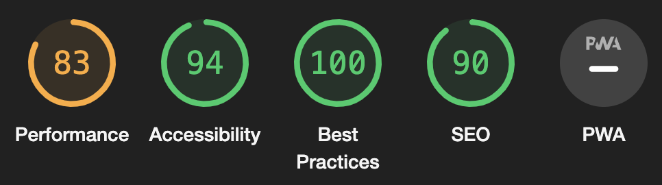
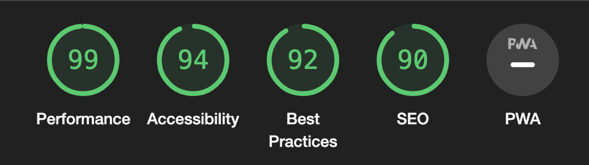

# Birmingham egg

Birmingham egg is a responsive website designed to provide information about Birmingham Egg, a local business specializing in high-quality eggs and polurty products. The website aims to showcase their range of products, provide details on how to visit their location, and offer convenient contact options for inquiries and deliveries.

[View Birmingham Egg on Github Pages](https://itzrossyo.github.io/Birmingham-egg-milestone-project/)

## CONTENTS

- [User Experience (UX)](<#User-Experience-(UX)>)

  - [Initial Discussion](#Initial-Discussion)
  - [User Stories](#User-Stories)

- [Design](#Design)

  - [Colour Scheme](#Colour-Scheme)
  - [Typography](#Typography)
  - [Imagery](#Imagery)
  - [Wireframes](#Wireframes)
  - [Features](#Features)
  - [Accessibility](#Accessibility)

- [Technologies Used](#Technologies-Used)

  - [Languages Used](#Languages-Used)
  - [Frameworks, Libraries & Programs Used](#Frameworks,-Libraries-&-Programs-Used)

- [Deployment & Local Development](#Deployment-&-Local-Development)

  - [Deployment](#Deployment)
  - [Local Development](#Local-Development)
    - [How to Fork](#How-to-Fork)
    - [How to Clone](#How-to-Clone)

- [Full Testing](#Full-Testing)

  - [W3C Validator](#W3C-Validator)
  - [Solved Bugs](#Solved-Bugs)
  - [Known Bugs](#Known-Bugs)
  - [Testing User Stories](#Testing-User-Stories)
  - [Lighthouse](#Lighthouse)

    - [Index Page](#Index-Page)
    - [Contact Us Page](#Contact-Us-Page)

- [credits](#credits)

- [disclaimer](#disclaimer)

---

## User Experience (UX)

The website is optimized to be accessible on various devices, ensuring that users can easily explore Birmingham Egg's offerings regardless of whether they are using a desktop computer, tablet, or mobile phone.

### Initial Discussion

Birmingham egg is a real life website for thats been re diseinged for modren internet showing all the information about the team members and products that thay have for sale.

#### Key information for the site

- how to get there.
- contact information about deliverys or for more information.
- what products they have for sale.

---

#### Client Goals

- As a client, I want to be able to view the website on a range of device sizes to ensure accessibility for all users.

  - [Somsung s20 ultra](assets/images/webiste-visitor-goals/samsung-galaxy-s20-ultra.webp)

  - [ipad](assets/images\webiste-visitor-goals\iPad.webp)

  - [iphone ](assets/images/webiste-visitor-goals/iphone_6_7_8_plus.webp)

  - [1080p laptop](assets/images/webiste-visitor-goals/laptop-1080p.webp)

- As a client, I want potential customers to easily find information about the products Birmingham Egg has for sale.

  - [All Products](assets/images/webiste-visitor-goals/pixel.webp)

- As a client, I want to provide contact information for deliveries and make it easy for users to reach out with further questions.

  - [contact-us](assets/images/webiste-visitor-goals/contact-infomation.webpp)

---

#### First Time Visitor Goals

- As a first-time visitor, I want to find out what products Birmingham Egg sells and how I can visit their location.

  - [we are here](assets/images/webiste-visitor-goals/where-are-we.webp)

- As a first-time visitor, I want to be able to navigate the website easily to find the information I need.

  https://github.com/itzrossyo/Birmingham-egg-milestone-project/assets/81793480/7038ce35-0240-4bce-b6e0-9892c19e041d

- As a first-time visitor, I want to learn about the team members of Birmingham Egg.

  - [we are here](assets/images/webiste-visitor-goals/team-members.webp)

#### Returning Visitor Goals

- As a returning visitor, I want to find up-to-date information on the products available for purchase.

- As a returning visitor, I want to easily contact Birmingham Egg with any questions I might have.

#### Frequent Visitor Goals

- As a frequent visitor, I want to be able to recommend Birmingham Egg to others based on my positive experiences.

  - [google reviews](assets/images/webiste-visitor-goals/positive-feedback.webp)

---

## Design

### Colour Scheme

The website uses a palette of pastel colours that are often used in the Birmingham Eggs images. The colour palette was created using the [Coolors](https://coolors.co/) website.

- The main color for the footer and nav bar through out the website. - #D57b65 

- The main color that was used through out the website background. - #fdf2ee 
- For the contact form I went with the color. - #6aa2aa 
- To make the dropdown menu stand out wehn on mobile I went for something a little darker - #7a7373 

### Typography

Google Fonts was used for the following fonts:

- Roboto is used through outsite. with a full back ans-serif.

### Imagery

The member images were used with the permission of their owners from Birmingham Egg.

### Wireframes

Wireframes were created for mobile, tablet and desktop.

[Home Page Wireframe](./assets/readme-images/homepage-desktop.png)

[Products page Wireframe](./assets/readme-images/products-desktop.png)

[About Us Wireframe](./assets/readme-images/about-us-desktop.png)

---

### Features

The website is comprised of 9 pages, all are accessible from the navigation menu (home page, products page, about us page & contact us page). The 5 other page is a is shown once a user is on the product page and then they are able to select other products to filter out.

- All Pages on the website have:

  - A responsive navigation bar at the top which allows the user to navigate through the site. To the left of the navigation bar is an slogan of birmingham eggs moto. in the center of the navigation bar are the links to the websites pages (home, products, about us and contact). To allow a good user experience of the site, the links are hidden with a media query on mobile devices to prevent the navigation bar looking cluttered. When viewing with mobile devices the navigation links change to a burger toggler. This was implemented to give the site a clean look and to promote a good user experience, as users are used to seeing the burger icon when on mobile devices to navigate a site.

  - A footer which contains the copyright information for the company

- Home Page.

  - what are brimgingham egg main features and what they sale
  - with a dropdown menu for accesing the map in mobile or at the botom of the screen. on desktop there is a map the map will open up google maps if the usser is on mobile.

- Contact Us Page.

  - Form.

    - The form contains the users name, email address a text area for the user to add further information. The user submits the form using the submit button. what will opena new page open saying thank you Users must fill in the name, email and text area fields to be able to submit the form. If they don't a tooltip will guide them to fill in any information they have missed. once this has been submited the form will be sent to the bussnes email

- Products.

  - a whole slection of produts that birmingham egg have for sale

- ease of access the contact by phone button will open a pop up asking you if you would like to use facetime or any other type of call software you use on a laptop/pc.
  If the user is on mobile then it will open automatically the call allowing you to right away call.

---

### Accessibility

I have been mindful during coding to ensure that the website is as accessible friendly as possible. I have achieved this by:

- Using semantic HTML.
- Using descriptive alt attributes on images on the site.
- Ensuring that there is a sufficient colour contrast throughout the site.
- Ensuring menus are accessible by marking the current page as current for screen readers.

---

## Technologies Used:

### Languages Used:

- HTML and CSS and some a tiny javascript (for creating the btn) were used to create this website.

### Frameworks, Libraries & Programs Used:

- Vscode - for more customization text editor.

- Webstorm - difrrent choice of IDE.

- Figma - for ux desgin.

- Git - For version control.

- Github - To save and store the files for the website.

- Google Fonts - To import the fonts used on the website.

- Font Awesome - For the iconography on the website.

- Google Dev Tools - To troubleshoot and test features, solve issues with responsiveness and styling.

- [Favicon.io](https://favicon.io/) To create favicon.

- [Shields.io](https://shields.io/) To add badges to the README.

- [formspree.io](https://formspree.io) - for easy form submiting untill backend is done.

---

## Deployment & Local Development

### Deployment

Github Pages was used to deploy the live website. The instructions to achieve this are below:

1. Log in (or sign up) to Github.
2. Find the repository for this project, birmingham-egg-milestone-project.
3. Click on the Settings link.
4. Click on the Pages link in the left hand side navigation bar.
5. In the Source section, choose main from the drop down select branch menu. Select Root from the drop down select folder menu.
6. Click Save. Your live Github Pages site is now deployed at the URL shown.

### Local Development

#### How to Fork

To fork the Birmingham Egg repository:

1. Log in (or sign up) to Github.
2. Go to the repository for this project, Birmingham-egg-Project !(https://github.com/itzrossyo/Birmingham-egg-milestone-project/tree/main)
3. Click the Fork button in the top right corner.

#### How to Clone

To clone the Birmingham egg repository:

1. Log in (or sign up) to GitHub.
2. Go to the repository for this project, Birmingham-egg-milestone-project.
3. Click on the code button, select whether you would like to clone with HTTPS!https://github.com/itzrossyo/Birmingham-egg-milestone-project.git and copy the link shown.
4. Open the terminal in your code editor and change the current working directory to the location you want to use for the cloned directory.
5. Type 'git clone' into the terminal and then paste the link you copied in step 3. Press enter.

---

#### Full Testing

- Testing was ongoing throughout the entire build. I utilised Chrome developer tools while building to pinpoint and troubleshoot any issues as I went along.

- The following issues were raised during my mid project meeting with my mentor:

- There was an issue on the google pixel device where it was not responsive to font changes.

- There is a problem on the iphone when the dropdown menu is clicked this as been made aware in - [Known Bugs](#Known-Bugs).

Full testing was done on the following devices:

- laptop
  - macbook pro 13 2019
  - Hp omen 15 inch
  - dell xps
- Mobile
  - Oppo find x5 lite (6.42inch)
  - samsung s22 ultra
  - iPhone 13 pro max
  - iphone 12 max
  - iphone 12
  - google pixel 6

Full testing was done on the following browsers:

- Google Chrome
- Firefox
- Opera
- Safari

| Feature                     | Expected Outcome                                                                                                                  | Testing preformed                                                                                                                      | Result                                                                         | Pass/Fail |
| --------------------------- | --------------------------------------------------------------------------------------------------------------------------------- | -------------------------------------------------------------------------------------------------------------------------------------- | ------------------------------------------------------------------------------ | --------- |
| font-awesome icons          | icons will be used on the menu drop down to indicate what links do what more for friendly use case                                | to make sure the icons where showing up when the dropdown menu was called and the icons animated also                                  | this worked very well and showed up each time the hamburger button was clicked | Pass      |
| 404 error page              | this should come up when the user page won't load or are side it down giving them a custom special message                        | testing this was making sure I created the 404 page to show up                                                                         | the 404 page showed up when changed to a html file not there                   | Pass      |
| product page text animation | for letting the users know more about what page the are view instead of relaying on the tabs                                      | testing this was waiting for the pages to load and to see if the text animated into frame after each new product link was clicked      | this worked very well                                                          | Pass      |
| Contact us by phone         | when click on mobile or any device this will automatically ask if you will like to call.                                          | The test was preformed by clicking the button on mobile and seeing if it will ask you to call also on Mac it would pop up asking also. | this worked as intended                                                        | Pass      |
| Goole maps                  | when on mobile you can click the where are we and it should open straight into google map ready for you to get directions         | The test we performed by using the device and click the link and seeing if this did open google maps ready for you                     | this worked right away                                                         | Pass      |
| hamburger Button/animation  | once the page has loaded and on mobile the hamburger will do an animation showing a wobble effect lifting people know to press it | This test was preformed by once the page has loaded and watching it to see if it acutely wobbled                                       | this worked right way                                                          | Pass      |
| Dropdown menu               | once the hamburger button has been pressed on mobile a drop down menu will slide in from the left with a smooth animation         | this test was preformed by clicking on the hamburger menu to see if the dropdown menu will show up for the right smoothly              | this worked as intended                                                        | Pass      |

---

### Bugs

#### Solved bugs

| Num | Bug                                                                                                                                                                                                      | How I solved the bug                                                             |     |     |
| --- | -------------------------------------------------------------------------------------------------------------------------------------------------------------------------------------------------------- | -------------------------------------------------------------------------------- | --- | --- |
| 1   | As testing on many Mobile devices i had a bug where the google pixel phone. This was not responsing correclty to font size changes so i had to create a new media query just for the goolge pixel phone. | I wokred around this and made a new media query just for the goolge pixel phone. |     |     |
|     |                                                                                                                                                                                                          |                                                                                  |     |     |

#### Known Bugs

| known bugs | Bug issue                                                                                     | Plan to resolve                                |
| ---------- | --------------------------------------------------------------------------------------------- | ---------------------------------------------- |
| 1          | Dropdown menu overlaps the product item paragraph on iphone device but i ok on other devices. | I plane to carry on investing this for iphones |

---

### W3C Validator

The W3C validator was used to validate the HTML on all pages of the website. It was also used to validate CSS in the style.css file.

- [Index Page HTML](https://validator.w3.org/nu/?doc=https%3A%2F%2Fitzrossyo.github.io%2FBirmingham-egg-milestone-project%2Findex.html)
- [About Us HTML](https://validator.w3.org/nu/?doc=https%3A%2F%2Fitzrossyo.github.io%2FBirmingham-egg-milestone-project%2Fabout-us.html)
- [Contact Us Page HTML](https://validator.w3.org/nu/?doc=https%3A%2F%2Fitzrossyo.github.io%2FBirmingham-egg-milestone-project%2Fcontact-us.html)
- [404 Page HTML](https://validator.w3.org/nu/?doc=https%3A%2F%2Fitzrossyo.github.io%2FBirmingham-egg-milestone-project%2F404.html)
- [style.css CSS](https://jigsaw.w3.org/css-validator/validator?uri=https%3A%2F%2Fitzrossyo.github.io%2FBirmingham-egg-milestone-project%2F&profile=css3svg&usermedium=all&warning=1&vextwarning=&lang=en#warnings)

### Solved Bugs

### Testing User Stories

- First Time Visitors
  Test: Check if the homepage provides clear information about Birmingham Egg's main features.

- Test: Verify if the navigation menu allows easy access to the products page, providing information about what Birmingham Egg sells and how to visit.

- Test: Ensure that the website's navigation is intuitive and user-friendly.

- Test: Locate the team members' profiles on the website.

### Lighthouse

I used Lighthouse within the Chrome Developer Tools to allow me to test the performance, accessibility, best practices and SEO of the website.

#### Index Page

Initial lighthouse testing :

Suggestions:
Desktop:

1. Image elements do not have explicit width and height
2. Page prevented back/forward cache restoration 1 failure reason
3. Background and foreground colors do not have a sufficient contrast ratio.
   Final lighthouse testing:
4. Document does not have a meta description

Suggestions:
Mobile:

1.List items li are not contained within ul, ol or menu parent elements.

---

Pre final lighthouse testing:

After sorting out some of the accessibility out i was able to improve my score.

---

<h3 align="center">Desktop</h3>

<h3 align="center">Mobile</h3>

---

Finally after many hours later the final lighthouse testing:

<h3 align="center">Desktop</h3>

<h3 align="center">Mobile</h3>

#### disclaimer

- As this was a real life project for an compnay and will be buidling off this with new features (a database for imte filters for exampl) thre is now no audio or video was plaaced ontop website or pages.

- I am importing css into one css stylesheet.

- the popup window will only show up if the user clicks onto the contact button for call us.

### credits

- now credits will be giving out to anyone that has to do with html and css this has been done is by myself Ross Espley but will say a huge help for good doucmentaion on [MDN](https://developer.mozilla.org/en-US/) and [Web3c](https://www.w3schools.com/)

- credits for testing Craig, Gavin , kourty , amy , detti,joe and all of Birmingham Egg.
